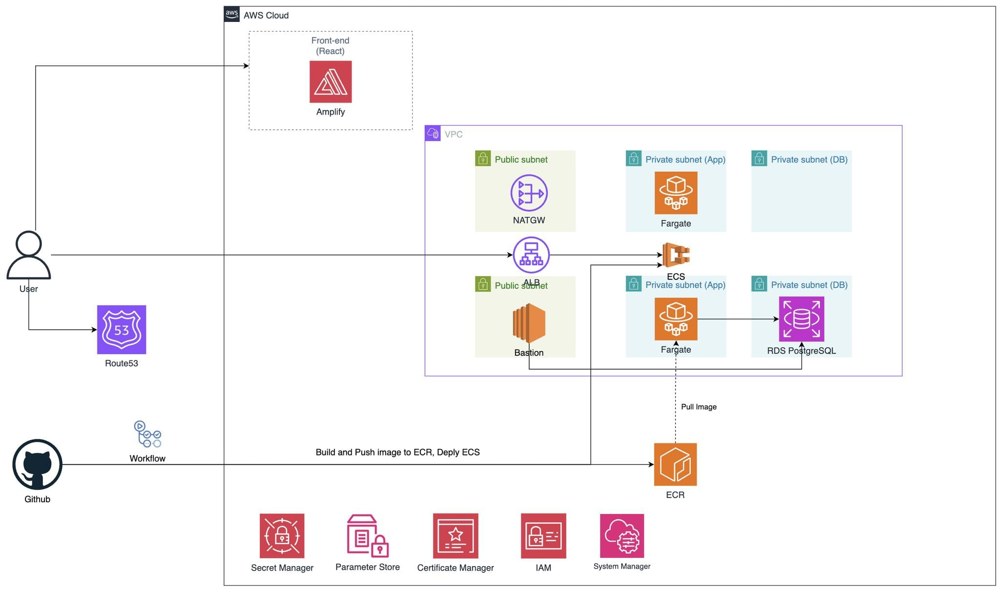

# 🚀 Exam Registration System - Cloud-Native AWS Deployment

A complete DevOps project demonstrating enterprise-level cloud architecture and CI/CD automation. Built with modern containerization, infrastructure as code, automated deployment pipelines, and production-grade monitoring stack on AWS.


---

## 📋 Table of Contents

- [Project Overview](#-project-overview)
- [Architecture](#-architecture)
- [AWS Infrastructure](#-aws-infrastructure)
- [CI/CD Pipeline](#-cicd-pipeline)
- [Monitoring](#-monitoring)
- [Security](#-security)
- [DevOps Skills](#-devops-skills-demonstrated)

---

## 🎯 Project Overview

This project showcases a production-ready cloud deployment on AWS, demonstrating industry-standard DevOps practices with automated CI/CD, infrastructure as code, containerization, and comprehensive observability.

**Key DevOps Achievements:**
- ✅ **Cloud-Native Architecture**: Serverless containers with managed AWS services
- ✅ **Automated CI/CD**: GitHub Actions for build, test, and container push
- ✅ **Infrastructure as Code**: Terraform for reproducible infrastructure
- ✅ **Container Orchestration**: ECS Fargate (zero server management)
- ✅ **Production Monitoring**: Prometheus + Grafana on EC2 bastion
- ✅ **Network Security**: Multi-layer VPC with public/private subnets
- ✅ **Secrets Management**: AWS Secrets Manager with IAM roles

---

## 🏗️ Architecture

### System Overview



### Network Architecture Details

**VPC Configuration (10.0.0.0/16)**:

| Layer | Subnet Type | CIDR Block | Availability Zones | Resources |
|-------|-------------|------------|-------------------|------------|
| **Public** | Public Subnet 1 | 10.0.1.0/24 | us-east-1a | NAT Gateway, EC2 Bastion |
| **Public** | Public Subnet 2 | 10.0.2.0/24 | us-east-1b | NAT Gateway (HA) |
| **Private** | App Subnet 1 | 10.0.11.0/24 | us-east-1a | ECS Fargate Tasks |
| **Private** | App Subnet 2 | 10.0.12.0/24 | us-east-1b | ECS Fargate Tasks (HA) |
| **Private** | DB Subnet 1 | 10.0.21.0/24 | us-east-1a | RDS MySQL Primary |
| **Private** | DB Subnet 2 | 10.0.22.0/24 | us-east-1b | RDS MySQL Standby |

**High Availability Setup**:
- ✅ Multi-AZ deployment (2 Availability Zones)
- ✅ Redundant NAT Gateways for fault tolerance
- ✅ RDS Multi-AZ standby for automatic failover
- ✅ ECS tasks distributed across multiple subnets

---

## ☁️ AWS Infrastructure

### AWS Services Used

| Service | Purpose | DevOps Focus |
|---------|---------|--------------|
| **ECS Fargate** | Serverless container orchestration (0 server management) | Container Orchestration |
| **EC2** | Bastion host for Prometheus/Grafana + DB access | Infrastructure Management |
| **ECR** | Private Docker image registry | Container Registry |
| **RDS MySQL** | Managed relational database (Multi-AZ ready) | Database as Service |
| **VPC** | Network isolation (public/private subnets, 2 AZs) | Network Architecture |
| **NAT Gateway** | Egress for private subnets (internet access) | Network Security |
| **Secrets Manager** | Centralized credential storage (auto-inject to ECS) | Secrets Management |
| **Security Groups** | Stateful firewall (principle of least privilege) | Access Control |
| **IAM Roles** | Fine-grained permissions (task execution + task roles) | Identity Management |
| **CloudWatch** | Centralized logging (ECS task logs) | Observability |
| **Amplify** | Static site hosting + auto-deployment (frontend) | CI/CD Integration |

### Security Architecture

**Multi-Layer Security**:
- **Network Isolation**: Private subnets with no direct internet access
- **Firewall**: Security Groups with least privilege rules
- **Egress Control**: All outbound traffic via NAT Gateway
- **Database Protection**: RDS in isolated DB subnet tier
- **Bastion Access**: EC2 jump host for secure administrative access

**Security Group Rules**:
- **Frontend SG**: Allow HTTPS (443) from internet
- **Backend SG**: Allow 8080 from Amplify only
- **Database SG**: Allow 3306 from Backend SG only
- **Bastion SG**: Allow SSH (22) from trusted IPs only

### ECS Fargate Configuration

- **CPU**: 0.5 vCPU | **Memory**: 1 GB
- **Network**: awsvpc (VPC networking only)
- **Launch Type**: Fargate (serverless)
- **Health Checks**: Spring Boot `/actuator/health` endpoint
- **Logging**: CloudWatch Logs (`/ecs/exam-backend`)
- **Secrets**: Injected from AWS Secrets Manager at runtime

---

## 🚀 CI/CD Pipeline

### GitHub Actions Workflow

**Trigger**: Push to `main` branch or manual dispatch

**Stages**:
1. **Checkout** - Clone code from GitHub
2. **Build** - Maven compile, test, package (JDK 21)
3. **Containerize** - Docker build with multi-stage optimization
4. **Registry** - Push to Amazon ECR with commit SHA tag
5. **Status** - Output image URI for manual ECS deployment

**Key Features**:
- ✅ Automated build on every push
- ✅ Maven dependency caching (faster builds)
- ✅ Docker multi-stage build (optimized image size)
- ✅ ECR image tagging with commit SHA
- ✅ AWS IAM credentials via GitHub Secrets

---

## 📊 Monitoring & Observability

### Prometheus + Grafana Stack (EC2 Bastion)

**Monitoring Flow**:
```
Prometheus (EC2) → Scrapes → ECS Tasks (/actuator/prometheus)
Grafana (EC2) ← Reads ← Prometheus ← Spring Boot Micrometer Metrics
```

**Metrics Collected**:
- Application: HTTP requests, error rates, response times
- JVM: Memory usage, GC performance, thread pools
- Database: Connection pools, query execution time
- Infrastructure: CPU, memory, network utilization

---

## 🔒 Security Best Practices

### Infrastructure Security

✅ **Network Isolation**
- Backend & database in private subnets
- Zero direct internet exposure
- Controlled egress via NAT Gateway

✅ **Secrets Management**
- Database credentials in AWS Secrets Manager
- No hardcoded passwords
- Runtime injection into ECS tasks

✅ **Identity & Access**
- IAM roles with least privilege
- Task execution role (container startup)
- Task role (application permissions)

✅ **Encryption**
- RDS encryption at rest
- TLS for data in transit
- ECR image encryption

✅ **Audit & Compliance**
- CloudWatch Logs for all ECS tasks
- IAM role-based access tracking
- Security group audit trails

---

## 🎯 DevOps Skills Demonstrated

This project showcases practical expertise in:

✅ **Cloud Architecture**
- Multi-tier VPC design (public/private subnets)
- High availability (Multi-AZ deployment)
- Secure network segmentation

✅ **Container Orchestration**
- ECS Fargate serverless containers
- Task definitions with health checks
- Auto-scaling policies

✅ **CI/CD Automation**
- GitHub Actions workflow automation
- Build & push pipelines
- Infrastructure integration

✅ **Infrastructure as Code**
- Terraform for reproducible infrastructure
- Version-controlled infrastructure
- Idempotent deployments

✅ **Monitoring & Observability**
- Prometheus metrics collection
- Grafana dashboards
- Log aggregation (CloudWatch)

✅ **Security & Access Control**
- IAM role-based access control
- Secrets management automation
- Network security (Security Groups)

✅ **AWS Service Integration**
- ECS, EC2, RDS, VPC, ECR
- Secrets Manager, IAM, CloudWatch
- Amplify for frontend deployment

---


## 📄 License

This project is created for educational and portfolio purposes.

---

## 👨‍💻 Author

**Nguyen Van Manh**
- GitHub: https://github.com/manhnv2110
- Email: nv.manhk68uet@gmail.com

---

<div align="center">

**⭐ If you found this project helpful, please star it!**

Made with cloud-native mindset and DevOps best practices

</div>
